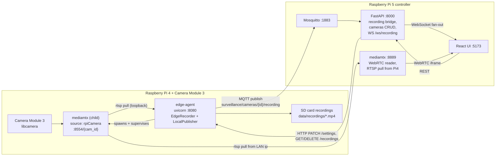

# SmartCam architecture

End-to-end description of how a Camera Module 3 on a Raspberry Pi 4 ends up
visible (and recorded) through the React UI on a Raspberry Pi 5 controller.
This is the canonical reference; the per-component READMEs only document the
local concerns of each tree.

## 1. Process map



Three independent processes per Pi 4 (uvicorn, mediamtx as child, plus the
recorder as a thread inside uvicorn), and three on the Pi 5 (mosquitto,
uvicorn, mediamtx as child of uvicorn). The React UI is a Vite dev server in
development; in production it can be served as static assets behind any HTTP
server.

## 2. Data flow per request

### 2.1 Live tile (browser → camera)

1. Browser loads the React UI from `:5173`.
2. UI iframes `http://<pi5>:8889/{mediamtx_path}/`.
3. Pi 5 MediaMTX serves the WHEP reader page (same-origin).
4. Reader pulls from path `{mediamtx_path}` whose `source` is the Pi 4's RTSP
   URL.
5. Pi 5 MediaMTX opens an RTSP TCP connection to `rtsp://<pi4>:8554/{cam_id}`.
6. Pi 4 MediaMTX child reads from `libcamera` via `source: rpiCamera`,
   H.264-encoded with the camera's hardware encoder.
7. Frames flow Pi 4 → Pi 5 over RTSP → browser over WebRTC.

### 2.2 Local recording (camera → SD)

1. Edge agent's `EdgeRecorder` thread opens
   `rtsp://127.0.0.1:8554/{cam_id}` via OpenCV/ffmpeg (loopback inside the
   Pi 4, no LAN hop).
2. **Motion mode:** every 3rd frame goes through MobileNet-SSD; trigger writes
   pre-roll JPEG ring + post-roll frames; ffmpeg muxes a `.mp4` into
   `data/recordings/`.
3. **Continuous mode:** ffmpeg ingests RTSP and writes 600 s segments
   directly via `-f segment`. A `-segment_list` file is tailed to detect
   newly closed segments for per-segment MQTT events.

### 2.3 Configuration push (UI → camera)

1. Operator changes settings in the UI; UI calls
   `PATCH /cameras/{id}/settings` on the controller.
2. Controller persists into `data/cameras.json` and calls
   `_push_edge_settings(cam_id)`, which does
   `httpx.patch({edge_base_url}/settings, json=settings)`.
3. Edge `/settings` endpoint forwards to `EdgeRecorder.update_settings`.
4. If `flip_180` or `quality` changed, `EdgeRecorder` notifies
   `LocalPublisher`, which debounces and restarts MediaMTX with new YAML.

### 2.4 Recording lifecycle MQTT (camera → UI)

```
EdgeRecorder ─► mqtt (Pi 4)
              ▲
              │ surveillance/cameras/{id}/recording (JSON)
              ▼
           Mosquitto (Pi 5)
              │
              ▼
       MqttRecordingBridge (FastAPI subscriber)
              │
              ▼
       RecordingWsHub.broadcast_json
              │
              ▼
       /ws/recording (browser tile shows red dot)
```

### 2.5 Recordings management (UI → camera)

- List: `GET /recordings/{id}` on controller proxies to `GET /recordings` on
  edge when `edge_base_url` is set.
- Download: `GET /recordings/{id}/files/{name}` streams via `httpx.stream`
  from the edge.
- Delete: `DELETE /recordings/{id}/files/{name}` calls
  `DELETE /recordings/files/{name}` on the edge, which `unlink()`s the file.

## 3. Storage and file layout

| Location | Purpose |
|----------|---------|
| `edge-agent/data/recordings/*.mp4` | Pi 4 SD card; motion clips and continuous segments |
| `edge-agent/data/recordings/_segments_{cam_id}.txt` | Continuous-mode segment list (tailed for MQTT) |
| `edge-agent/data/recordings/_tmp_*` | Motion-clip JPEG staging dirs (deleted after mux) |
| `controller/backend/data/cameras.json` | Saved cameras + per-camera settings |
| `controller/backend/data/mediamtx.generated.yml` | Auto-regenerated MediaMTX config |
| `controller/backend/data/recordings/{id}/` | Used **only** when a camera has no `edge_base_url` (legacy direct RTSP) |

## 4. Topics, schemas, and contracts

### 4.1 MQTT topics

```
surveillance/cameras/{mqtt_camera_id}/recording   (edge → controller)
```

`mqtt_camera_id` is the edge's `SURVEILLANCE_EDGE_CAMERA_ID` (default
`camera1`); operators **must** set this uniquely per Pi 4.

### 4.2 MQTT JSON schema

```jsonc
{
  "status": "Start" | "InProgress" | "Stop",
  "recording_id": "evt_1715271234123",       // motion: evt_*; continuous: cont_*
  "timestamp": "2026-05-09T08:14:00Z",       // ISO-8601 UTC
  "objects_detected": ["person", "car"],     // motion only; may be empty
  "local_path": "/abs/path/to/file_or_dir",  // file for motion Stop / continuous segment events; dir otherwise
  "filename": "evt_20260509_081400.mp4"      // present on motion Stop and on continuous per-segment events
}
```

`InProgress` is emitted ~1 Hz during a session. After T5 lands the continuous
mode emits an `InProgress` with `filename` for each newly closed segment, and
a final `Stop` with the last segment filename.

### 4.3 mDNS records

- Service: `_vigilance-edge._tcp.local.`
- Port: edge HTTP port (default `8080`).
- TXT keys: `id`, `name`, `location`, `rtsp`, `path`, `api_port`.
- After T2/T4: `rtsp` is **always** populated when `SURVEILLANCE_PI_CAMERA=1`,
  using the LAN URL `rtsp://<lan_ip>:8554/{cam_id}`. When the publisher is
  off and no `SURVEILLANCE_RTSP_URL` was supplied, `rtsp` is empty and the
  controller marks the discovery row `incomplete: true`.

### 4.4 HTTP routes

| Method | Path | Where |
|--------|------|-------|
| GET    | `/cameras` | controller |
| POST   | `/cameras` | controller |
| DELETE | `/cameras/{id}` | controller |
| GET    | `/cameras/{id}/settings` | controller |
| PATCH  | `/cameras/{id}/settings` | controller (also pushes to edge) |
| GET    | `/detect`, `/detect/edges` | controller |
| GET    | `/recordings/{id}` | controller (proxy → edge) |
| GET    | `/recordings/{id}/files/{name}` | controller (stream proxy → edge) |
| DELETE | `/recordings/{id}/files/{name}` | controller (proxy → edge) |
| WS     | `/ws/recording` | controller |
| GET    | `/health` | edge |
| GET    | `/recordings` | edge |
| GET    | `/recordings/files/{name}` | edge |
| DELETE | `/recordings/files/{name}` | edge |
| GET    | `/settings` | edge |
| PATCH  | `/settings` | edge |

## 5. Security boundaries

- **LAN-trust.** Both MediaMTX instances and the FastAPI APIs assume the LAN
  is trusted. `mosquitto` is bound to the controller's LAN IP (not
  `0.0.0.0`) by default in the bootstrap script and authenticates with a
  password unless run with `--anon`.
- **No secrets in code or git.** All credentials come from the environment;
  Committed **`.env`** files hold defaults; **`.env_example`** mirrors them for reference.
- **Filename safety.** `_SAFE_NAME = ^[A-Za-z0-9._-]+\.mp4$` is enforced on
  every recording GET/DELETE both on the controller and the edge.
- **Process least-privilege.** The edge `LocalPublisher` invokes `mediamtx`
  with explicit `argv` (`shell=False`), `stdin=DEVNULL`, and propagates only
  `PATH` from its environment.
- **No outbound calls.** The system does not phone home or fetch external
  resources at runtime; the only network activity is on the LAN.

## 6. Concurrency model

- The edge agent is a single uvicorn process. It hosts:
  - The FastAPI request handlers (asyncio).
  - One `EdgeRecorder` daemon thread that owns `cv2.VideoCapture` and
    `subprocess.Popen` for `ffmpeg`.
  - One `LocalPublisher` supervisor (post-T2) that owns the `mediamtx` child
    process.
- The controller has the same shape: FastAPI + the `RecordingManager`
  (legacy direct-RTSP cameras only) + the `MediaMTX` supervisor + the MQTT
  bridge thread.
- Cross-thread signalling is by `threading.Event` (`_stop`) and
  `threading.RLock` (state). No shared globals beyond per-module supervisor
  singletons. `paho-mqtt` runs its own loop thread.
- The MQTT bridge serializes WebSocket fan-out via
  `asyncio.run_coroutine_threadsafe` onto the FastAPI loop, so handler code
  never touches the bridge's lock from the MQTT thread.

## 7. Failure modes and degradation

| Failure | Effect | User-visible signal |
|---------|--------|--------------------|
| Pi 5 `mediamtx` down | Live tiles fail | Browser: "refused to connect" inside the iframe |
| Pi 4 `mediamtx` down | Pi 5 `mediamtx` retries every ~5 s | Pi 5 logs: `dial tcp ...: connection refused` |
| Pi 4 `mediamtx` binary missing | Publisher stays dormant; recorder cannot start | `/health.publisher_running == false`; backend log: `MediaMTX not started: no mediamtx binary on PATH` |
| Mosquitto down | UI red-dot indicators stuck | `/system/recording.mqtt_bridge == false` and missing `cameras` map in `/ws/recording` |
| Edge HTTP down | Settings PATCH and recordings list/delete fail | Controller logs `edge settings push failed` / `edge list failed: ...` |
| Camera Module unplugged | rpiCamera path errors | Pi 4 mediamtx logs: `[rpiCamera source] failed to open camera` |

## 8. Forward-compatibility notes

- MediaMTX YAML keys evolve across releases (e.g. `webrtcAllowOrigin` →
  `webrtcAllowOrigins`, with strict unknown-field rejection). Both supervisors
  emit only fields known to be stable across the v1.x line; CORS allow-lists
  are intentionally omitted because all consumers are same-origin from the
  reader's perspective.
- The `quality` knob is treated as a single source of truth at the
  `LocalPublisher` (encoder side) and is no longer interpreted in the
  controller-side recorder, since that recorder does not run when the camera
  has an `edge_base_url`.
