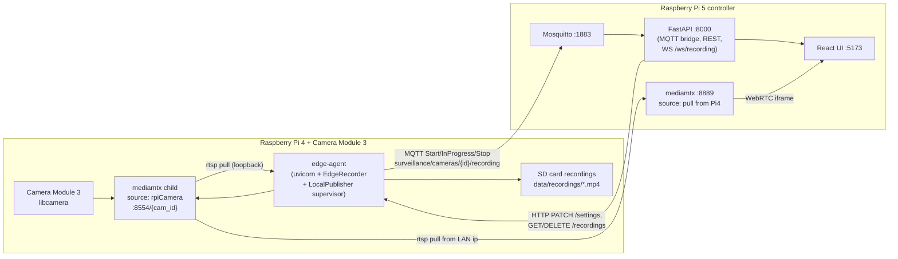
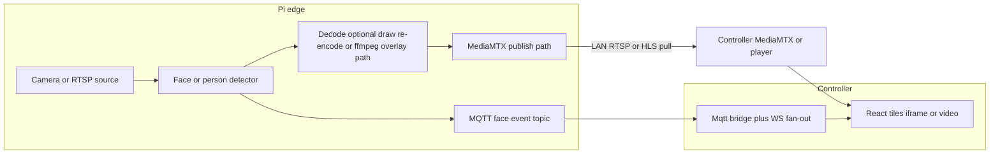
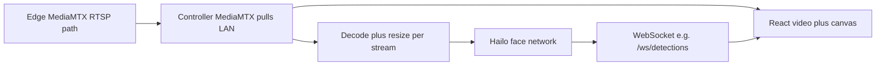

# SmartCam spec-fit plan

## 1. Audit verdict (one line per spec item)

- **Spec 1 — Edge streams to controller:** **MISSING.** No producer exists in [edge-agent/app/](../edge-agent/app/); the recorder is consumer-only at [edge-agent/app/worker.py](../edge-agent/app/worker.py).
- **Spec 1 — Local SD recording:** **DONE.** Motion + continuous in [edge-agent/app/worker.py](../edge-agent/app/worker.py); only runs when `SURVEILLANCE_RTSP_URL` is set ([edge-agent/app/main.py](../edge-agent/app/main.py) lines 65–84) unless the local publisher supplies loopback RTSP.
- **Spec 1 — MQTT Start/End with location:** **DONE for motion.** `Stop` carries `local_path` + `filename` ([edge-agent/app/worker.py](../edge-agent/app/worker.py) lines 444–449). **PARTIAL for continuous** — addressed with per-segment events in this plan.
- **Spec 2 — Broker on controller:** Subscriber done in [controller/backend/app/mqtt_bridge.py](../controller/backend/app/mqtt_bridge.py); the broker (Mosquitto) is an external prerequisite scripted in `controller/scripts/install-mosquitto.sh`.
- **Spec 3.a — Zeroconf detection:** **DONE.** [controller/backend/app/discovery.py](../controller/backend/app/discovery.py).
- **Spec 3.b — Up to 6 tiles:** **DONE.** `MAX_LIVE_TILES = 6` in [controller/frontend/src/App.jsx](../controller/frontend/src/App.jsx).
- **Spec 3.c.i Continuous / 3.c.ii Motion 10s+50s:** **DONE.** Defaults in [controller/backend/app/camera_store.py](../controller/backend/app/camera_store.py); UI exposes both.
- **Spec 3.c.iii Push config to camera:** **DONE.** `_push_edge_settings` HTTP PATCH `/settings` in [controller/backend/app/main.py](../controller/backend/app/main.py); consumed at [edge-agent/app/main.py](../edge-agent/app/main.py).
- **Spec 3.d View/Download/Delete (and edge-side delete):** **DONE.** Controller proxies to the edge.

The chosen architecture is **Option B**: edge-agent supervises its own MediaMTX child for the Pi camera, mirroring [controller/backend/app/mediamtx_manager.py](../controller/backend/app/mediamtx_manager.py).

## 2. Target topology

## 3. Concurrency / security / validation guardrails

- Supervisor state guarded by `threading.RLock`; debounced restart matches the controller MediaMTX pattern.
- No module-level mutable process handles for the edge publisher; state lives on `LocalPublisher`.
- Inputs validated: env flags, port ranges (1024–65535), path keys for MediaMTX paths, quality enums.
- `subprocess.Popen` with `shell=False`, list argv, `stdin=DEVNULL`.
- Mosquitto installer binds the listener to the LAN IP by default; `allow_anonymous` only with `--anon`.
- Recording HTTP endpoints keep `_SAFE_NAME` validation on filenames.

## 4. Work breakdown

See repository implementation: `edge-agent/app/local_publisher.py`, `controller/scripts/install-mosquitto.sh`, `edge-agent/scripts/install-rpi-mediamtx.sh`, and [ARCHITECTURE.md](ARCHITECTURE.md).

## 5. Out of scope for this plan

- Replacing the `ENVCAM/` legacy venv on the controller.
- A **production Hailo tensor pipeline** on the controller (design tradeoffs in §7; not implemented in [`surveillance_shared/detector.py`](../controller/shared/surveillance_shared/detector.py) today — code still references OpenCV MobileNet-SSD only).
- TLS/auth on MediaMTX or FastAPI (LAN-trust assumption; documented in ARCHITECTURE.md).

## 6. Alternative plan — edge face detection, overlaid video, controller events

**Goal:** Keep inference on each **edge** Pi; avoid controller-side decode/load for 3–4 streams. The edge detects faces (or person boxes—see semantics below), **draws bounding boxes into the outbound preview stream**, and **publishes discrete MQTT events** (timestamp, counts, optional metadata) so the controller UI can show a notification panel without running vision.

### 6.1 Topology (conceptual)

### 6.2 Face detection on edge

- Reuse or extend [`edge-agent/shared/surveillance_shared/detector.py`](../edge-agent/shared/surveillance_shared/detector.py): today MobileNet-SSD VOC exposes **person** instances (full body), not facial landmarks. Either treat **person box count** as the MVP for “faces,” or add **OpenCV Haar / DNN face** on the Pi if literal faces are required (extra CPU).
- Run detection on the **same decoded frames** already used for motion recording where possible to avoid a second full decode (`worker.py` motion loop), or share one capture pipeline with the overlay publisher.

### 6.3 Box overlay “into the video” the controller sees

- **Meaning:** The stream the controller pulls from MediaMTX (or edge RTSP) already contains drawn rectangles, so the existing **iframe** reader can show boxes **without** client-side canvas geometry.
- **Implementation options (pick one in implementation):**
  - **Transcode pipeline:** decode → detect → draw (`cv2.rectangle` or ffmpeg `drawbox`) → encode → publish to MediaMTX path the controller already uses. Cost: sustained CPU/GPU on the edge; tune resolution/FPS.
  - **Parallel low-res overlay branch:** keep full-quality recording path unchanged; publish a **second** lower-resolution “preview with boxes” path for the dashboard only.
- **Risk:** Duplicating encode increases Pi thermals and latency; validate on hardware before making overlay the only live path.

### 6.4 Controller notification events

- New MQTT topic (example): `surveillance/cameras/{mqtt_camera_id}/faces` (or `…/detections`) with JSON payload, e.g. `{ "timestamp": "<ISO8601 UTC>", "face_count": <int>, "source": "ssd_person|haar|…" }`, bounded and validated on subscribe ([`controller/backend/app/mqtt_bridge.py`](../controller/backend/app/mqtt_bridge.py)).
- Extend bridge **WebSocket** snapshot/update shape so [`controller/frontend/src/App.jsx`](../controller/frontend/src/App.jsx) can render a **notification panel** (time/date, count, camera name resolved from `camera_store`).
- Optional: reuse or parallel [`surveillance/cameras/{id}/recording`](../controller/backend/app/mqtt_bridge.py) patterns for topic prefix and env (`CONTROLLER_MQTT_*`).

### 6.5 Compared to controller-side monitoring

| Aspect | This alternative (edge) | Controller monitors all streams |
|--------|-------------------------|----------------------------------|
| Controller CPU | Low (MQTT + UI) | High decode + inference unless heavily optimized |
| Overlay in UI | Natural via overlaid encode | Needs `video` + canvas or server burn-in |
| Per-camera scale | Load spreads across Pis | Central bottleneck |
| Consistency | One overlay path per edge | Single codebase for all cameras |

### 6.6 Out of scope for section 6 until implemented

- Exact ffmpeg/OpenCV pipeline layout on the edge and whether overlay replaces or supplements the current LocalPublisher path.
- Whether face events also trigger **recording** on the edge (can hook into existing motion cooldown logic or a dedicated “force clip” API).

**Note:** §6 optimizes for **keeping decode/inference off the controller**. If the product goal expands to **rich multi-class analytics** (person + animal + vehicle + optional face) at several streams with consistent overlays, read §7 — **controller Hailo** often wins for model throughput; the edge plan remains best when minimizing Pi 5 load and accepting lighter per-edge models.

## 7. Scaling multi-class detection — edge vs controller Hailo

### 7.1 What the edge already does

- The shared [`Detector`](../edge-agent/shared/surveillance_shared/detector.py) is **not face-only**: one MobileNet-SSD VOC forward pass already maps **person, vehicle, and animal** classes (plus motion fallback when weights are missing).
- On a **Pi 4 edge**, that is cheap enough for **sparse sampling** tied to motion clips (see [`worker.py`](../edge-agent/app/worker.py) `DETECT_EVERY_N_FRAMES`). It does **not** automatically mean “scale” for **continuous multi-stream overlays**, second-stage **face** refinement, or **heavier** models without thermal/CPU limits.

### 7.2 Where edge-centric detection strains

- **Overlay + encode** on the edge (§6.3) adds sustained **decode → draw → encode** cost on top of inference.
- Running **multiple models** (e.g. general SSD + face cascade) per camera multiplies CPU use.
- Many edges × rich analytics centralizes **engineering** complexity (different Pi revisions, cooling).

### 7.3 Where controller + Hailo fits better

- **Single accelerator** running one **multi-class** graph (e.g. YOLO/SSD variant compiled for Hailo) gives **predictable FPS per watt** for person / vehicle / animal / (optional) face heads — often easier than tuning several Pi 4 CPUs.
- **One codebase** for model versions, thresholds, and UI box semantics across all cameras.
- **Caveat:** The controller Pi still pays **ingress + decode** for every analyzed stream (§7.4). Hailo solves **inference**, not magically all H.264 decode cost — mitigate with subsampling, resize-before-NPU, or fewer full-FPS pipelines.

### 7.4 Suggested directions (pick based on ops tolerance)

| Strategy | Idea | Fits when |
|----------|------|-----------|
| **A — Controller Hailo primary** | Controller ingests streams (or scaled proxies), runs Hailo multi-class, publishes **MQTT/WS** detection + optional **UI overlays** (`video` + canvas or downstream transcoded preview). | You want **consistent** person/animal/vehicle (+ face later) labels and boxes on the dashboard; Pi 5 + Hailo is in play; **3–4 HD streams** with tuned FPS/resolution (your stated scale). |
| **B — Hybrid** | Edge keeps **light SSD** (or motion) only for **local clip capture** and resilience when LAN/controller is down; controller Hailo drives **notifications + overlay semantics** for the UI. | You want **recordings without controller dependency** but **rich UI** when controller is online. Dedupe policy needed so edge motion + controller alerts don’t duplicate clips unless intended. |
| **C — Edge-only modest** | No Hailo on controller; edge SSD + optional low-FPS overlay path; face as **person-box proxy** or small extra model on edge only. | Few cameras, minimize controller compute, accept **lighter** or **less uniform** analytics. |
| **D — Hailo per edge (future hardware)** | Same multi-class story as A but **distributed**. | Budget for accelerator per site and consolidated deployment tooling. |

### 7.5 Recommendation summary

- For **human + animal + vehicle** at dashboard quality with **Hailo already on the controller**, **§7.4-A or B** is usually the better fit than pushing **full multi-class + overlay** solely onto **Pi 4 edge-agents**.
- Keep **§6** as the right pattern when the priority is **minimal controller load** and **acceptable** edge-side CPU models — understanding that “face” may remain a **proxy** (person boxes) or a **small add-on**, not a full second pipeline at scale.

### 7.6 Out of scope for §7 until implemented

- Concrete Hailo graph choice, GStreamer vs proprietary SDK paths, and measured FPS on Pi 5 for N simultaneous decodes.
- Controller API/WebSocket schema for per-frame boxes vs throttled summaries.

## 8. Chosen architecture — Plan A (phased)

**Decision:** Implement **§7.4 strategy A — Controller Hailo primary**, split into phases below. Sections §6 (edge overlay) and §7.4-B–D remain **alternatives** unless we revisit scale or offline-first requirements.

### 8.1 Phase overview

| Phase | Scope | Status |
|-------|--------|--------|
| **1** | Live streams terminate at controller path; controller runs **face** detection on Hailo; **draw boxes** on dashboard live tiles (client overlay). | **Plan only — implement first** |
| **2** | Controller signals edge-agent to **start recording**; clip length policy (see note); edge signals **recording complete** to controller. | Deferred |
| **3** | TBD after Phases 1 and 2. | Deferred |

**Phase 2 note:** Spec mentioned both **~1 minute** recording and **same 10+50 second logic** (pre/post from [`camera_store`](../controller/backend/app/camera_store.py) / edge settings). Before coding Phase 2, pick one: **fixed-duration command** (e.g. 60s wall-clock), **reuse existing pre_record + post_record** (e.g. 10+50), or **configurable per camera**.

---

## 9. Phase 1 — Controller Hailo face detection + live box overlay

### 9.1 Objective

- Edges continue to publish **live** video as today (RTSP → edge MediaMTX; controller MediaMTX **pulls** paths — see §2 topology). No new “face” workload on the edge for Phase 1.
- The **controller** (Pi 5 + Hailo) **decodes** each dashboard camera stream (or a **downscaled** proxy of it), runs **face** inference on the accelerator, and exposes **bounding boxes** (normalized coordinates) to the UI.
- The **React** app **draws rectangles** over the live preview (replace or complement MediaMTX **iframe** with a `<video>` element fed by the same stream the human watches, plus a transparent `<canvas>` aligned with letterboxing math).

### 9.2 High-level data flow

- **Two consumers** of the same logical stream are acceptable in Phase 1: **browser** playback (existing URL pattern from [`App.jsx`](../controller/frontend/src/App.jsx) `streamUrlForCamera`) and **controller Python** decoder for Hailo (may pull the **same** controller-relative MediaMTX/RTSP URL to avoid extra edge hops — validate LAN bandwidth).

### 9.3 Controller backend work items

1. **Stream registry** — For each saved camera in [`camera_store`](../controller/backend/app/camera_store.py), resolve a stable **RTSP or HTTP read URL** the inference worker can open (likely via controller-hosted MediaMTX path already used by the UI). Validate URL scheme and refuse untrusted inputs.
2. **Inference worker(s)** — One async-friendly design: **per-camera asyncio task or thread** that:
   - Opens capture (OpenCV `VideoCapture`, PyAV, or **GStreamer** if using Hailo’s typical pipelines).
   - **Subsamples** FPS (e.g. 5–15 Hz effective) and **resizes** frames to Hailo network resolution before NPU submit.
   - Runs **Hailo face model** (exact APP/HAR/SDK step is integration-specific — placeholder module until binaries exist in repo or system path).
   - Maps outputs to **normalized boxes** `[x,y,w,h]` in `0..1` relative to **model input** frame, plus optional confidence; attach `camera_id`, `timestamp` (UTC ISO).
3. **Fan-out** — New **WebSocket** endpoint (e.g. `/ws/detections`) broadcasting JSON messages:
   - Either **per-detection** messages or **batched** per tick per camera (throttle to avoid flooding UI).
   - Schema sketch: `{ "type": "detections", "camera_id": <int>, "ts": "<ISO8601>", "faces": [ { "x":0,"y":0,"w":0,"h":0,"score":0 } ] }`.
4. **Lifecycle** — Start/stop workers with FastAPI lifespan; on camera list changes, restart or diff subscriptions (Phase 1 can **restart all workers** on simple timer or admin action if dynamic CRUD is deferred).
5. **Diagnostics** — Optional `GET /detector/hailo/status` mirroring pattern of existing detector diagnostics if useful.

### 9.4 Frontend work items

1. **LiveTile** — For Phase 1, use **`video`** element (HLS or native playback URL MediaMTX exposes — confirm format per path; may require **hls.js** or switch reader URL from iframe-only page to **direct manifest/stream URL**).
2. **Overlay** — Absolutely positioned **`canvas`** with `pointer-events: none` over the video; on resize and on each WS message, redraw boxes using **video letterbox** math (`object-fit: contain` equivalence).
3. **WebSocket client** — Connect to `VITE_WS_DETECTIONS_URL` or derive from API host like [`WS_RECORDING`](../controller/frontend/src/App.jsx); filter messages by `camera_id`.
4. **Fallback** — If WS disconnected or Hailo unavailable, show stream **without** boxes (no hard failure).

### 9.5 Performance guardrails (Phase 1)

- Target deployment: **~3–4 HD streams** — enforce **max concurrent inference streams** (reuse `MAX_LIVE_TILES` or separate cap).
- Prefer **resize-before-Hailo** and **frame skip** over full-FPS on every camera.
- Measure **CPU decode** separately from **Hailo FPS** on hardware before promising UI frame rates.

### 9.6 Explicitly out of scope for Phase 1

- MQTT face events, notification history panel, or recording triggers (Phase 2).
- Multi-class person/animal/vehicle on Hailo (can be Phase 3+ once face path works).
- Burning boxes **into** the encoded stream server-side (client overlay only).
- TLS and auth on new WebSocket (LAN-trust assumption consistent with §5).

### 9.7 Phase 2 preview (not implemented yet)

- Controller → edge **command channel** (HTTP on edge agent and/or MQTT command topic): “begin recording episode.”
- Edge uses existing **motion materialization** path or a thin wrapper around [`EdgeRecorder`](../edge-agent/app/worker.py) with agreed duration/pre-post policy.
- Completion signaled via **existing MQTT recording `Stop`** payloads or explicit **completion** message — align with [`mqtt_bridge.py`](../controller/backend/app/mqtt_bridge.py).

### 9.8 Phase 3

- Defined after Phase 1 and 2 validation (e.g. notifications UX, multi-class Hailo, hybrid edge fallback).
