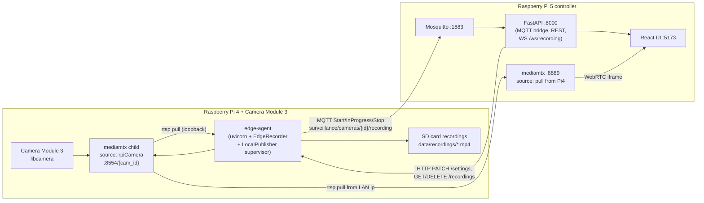

# SmartCam spec-fit plan

## 1. Audit verdict (one line per spec item)

- **Spec 1 — Edge streams to controller:** **MISSING.** No producer exists in [edge-agent/app/](../edge-agent/app/); the recorder is consumer-only at [edge-agent/app/worker.py](../edge-agent/app/worker.py).
- **Spec 1 — Local SD recording:** **DONE.** Motion + continuous in [edge-agent/app/worker.py](../edge-agent/app/worker.py); only runs when `SURVEILLANCE_RTSP_URL` is set ([edge-agent/app/main.py](../edge-agent/app/main.py) lines 65–84) unless the local publisher supplies loopback RTSP.
- **Spec 1 — MQTT Start/End with location:** **DONE for motion.** `Stop` carries `local_path` + `filename` ([edge-agent/app/worker.py](../edge-agent/app/worker.py) lines 444–449). **PARTIAL for continuous** — addressed with per-segment events in this plan.
- **Spec 2 — Broker on controller:** Subscriber done in [controller/backend/app/mqtt_bridge.py](../controller/backend/app/mqtt_bridge.py); the broker (Mosquitto) is an external prerequisite scripted in `controller/scripts/install-mosquitto.sh`.
- **Spec 3.a — Zeroconf detection:** **DONE.** [controller/backend/app/discovery.py](../controller/backend/app/discovery.py).
- **Spec 3.b — Up to 6 tiles:** **DONE.** `MAX_LIVE_TILES = 6` in [controller/frontend/src/App.jsx](../controller/frontend/src/App.jsx).
- **Spec 3.c.i Continuous / 3.c.ii Motion 10s+50s:** **DONE.** Defaults in [controller/backend/app/camera_store.py](../controller/backend/app/camera_store.py); UI exposes both.
- **Spec 3.c.iii Push config to camera:** **DONE.** `_push_edge_settings` HTTP PATCH `/settings` in [controller/backend/app/main.py](../controller/backend/app/main.py); consumed at [edge-agent/app/main.py](../edge-agent/app/main.py).
- **Spec 3.d View/Download/Delete (and edge-side delete):** **DONE.** Controller proxies to the edge.

The chosen architecture is **Option B**: edge-agent supervises its own MediaMTX child for the Pi camera, mirroring [controller/backend/app/mediamtx_manager.py](../controller/backend/app/mediamtx_manager.py).

## 2. Target topology

## 3. Concurrency / security / validation guardrails

- Supervisor state guarded by `threading.RLock`; debounced restart matches the controller MediaMTX pattern.
- No module-level mutable process handles for the edge publisher; state lives on `LocalPublisher`.
- Inputs validated: env flags, port ranges (1024–65535), path keys for MediaMTX paths, quality enums.
- `subprocess.Popen` with `shell=False`, list argv, `stdin=DEVNULL`.
- Mosquitto installer binds the listener to the LAN IP by default; `allow_anonymous` only with `--anon`.
- Recording HTTP endpoints keep `_SAFE_NAME` validation on filenames.

## 4. Work breakdown

See repository implementation: `edge-agent/app/local_publisher.py`, `controller/scripts/install-mosquitto.sh`, `edge-agent/scripts/install-rpi-mediamtx.sh`, and [ARCHITECTURE.md](ARCHITECTURE.md).

## 5. Out of scope for this plan

- Replacing the `ENVCAM/` legacy venv on the controller.
- Hailo-accelerated motion detection on the controller.
- TLS/auth on MediaMTX or FastAPI (LAN-trust assumption; documented in ARCHITECTURE.md).
